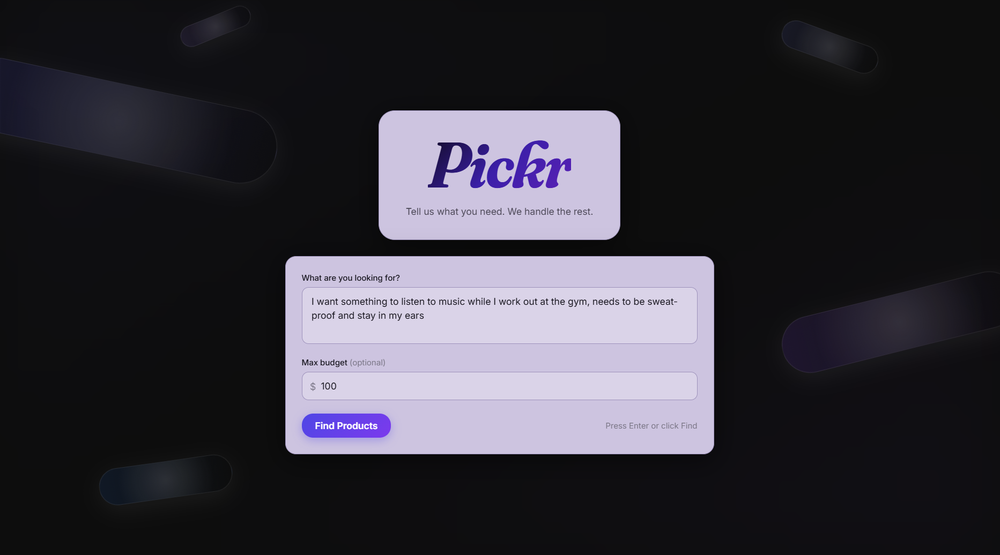
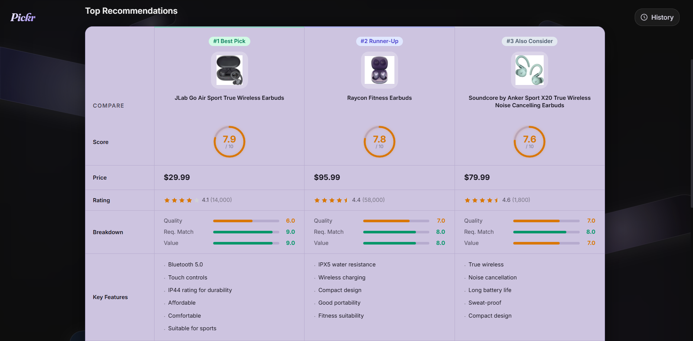
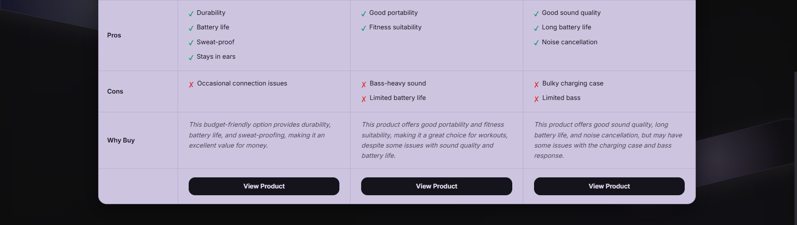
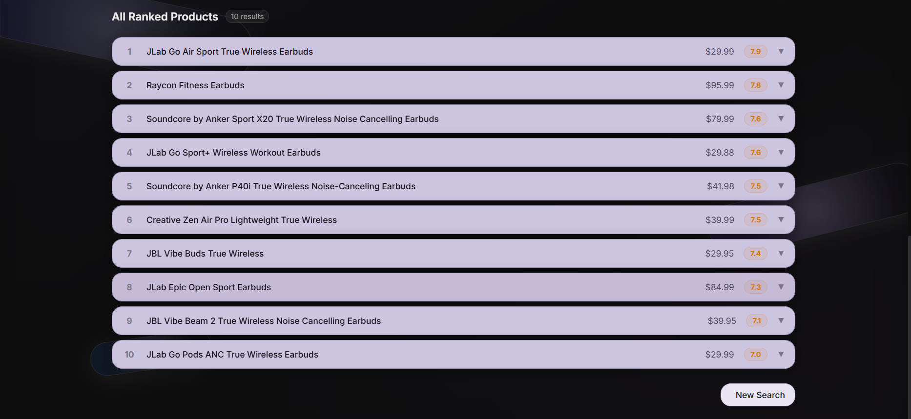

<div align="center">

# Pickr — AI-Powered Product Recommender

Most product search is broken. The top results are ads, the "best of" articles are SEO bait, and nothing tells you how well a product actually matches what you need. Pickr is an attempt to fix that.

It takes a plain-English shopping query and returns a ranked, scored shortlist of real products. It restructures your query, searches Google Shopping, fetches and normalizes specs from multiple sources, then uses an LLM to score every product across quality, requirement fit, and value. The result is a comparison table you can actually make a decision from.

[](https://pickrshoppingassistant.vercel.app/)

---

[](https://nextjs.org/)
[](https://react.dev/)
[](https://www.typescriptlang.org/)
[](https://www.python.org/)
[](https://fastapi.tiangolo.com/)
[](https://github.com/langchain-ai/langgraph)
[](https://www.docker.com/)

</div>

---

## Table of Contents

- [Screenshots](#screenshots)
- [End-to-End Pipeline](#end-to-end-pipeline)
- [Features](#features)
- [LLM Usage](#llm-usage)
- [Challenges](#challenges)
- [Tech Stack](#tech-stack)
- [Setup and Installation](#setup-and-installation)
- [Project Structure](#project-structure)
- [AI-Assisted Design](#ai-assisted-design)

---

## Screenshots








---

## End-to-End Pipeline

A single search request flows through four stages, each implemented as a LangGraph node. The frontend receives live status updates via SSE throughout.

```
User Query (natural language)
        │
        ▼
┌─────────────────────────┐
│  Node 1: Query Rewrite  │  LLM translates + restructures the query
│                         │  into precise Google Shopping terms
└────────────┬────────────┘
             │  processed_query { translated, restructured }
             ▼
┌─────────────────────────┐
│  Node 2: Product Search │  SerpAPI → Google Shopping top-20
│                         │  Deduplication by title similarity
└────────────┬────────────┘
             │  products[]  { title, price, rating, reviews, image, url }
             ▼
┌─────────────────────────┐
│  Node 3: Spec Extraction│  Tavily /extract (batch, 10 URLs/call)
│                         │  + SerpAPI google_product enrichment
│                         │  + Tavily search (per-product fallback)
│                         │  → LLM normalizes into structured specs
└────────────┬────────────┘
             │  detailed_products[]  { key_features, pros, cons, summary }
             ▼
┌─────────────────────────┐
│  Node 4: Rank & Score   │  Pre-filter by budget (5% tolerance)
│                         │  Deterministic: rating_score
│                         │  LLM: quality, matching_requirements,
│                         │       value_for_money, reason
│                         │  Weighted composite score → top-10
│                         │  LLM generates 2-3 sentence summary
└────────────┬────────────┘
             │
             ▼
        Ranked Results
  { recommendations (top 3), ranked_products (top 10), analysis_summary }
```

---

## Features

- **Natural language input** — describe what you want conversationally; the LLM handles query normalization
- **Budget filtering** — hard cap with 5% tolerance, enforced before scoring
- **Structured comparison table** — top 3 products in a side-by-side grid with animated score rings, score bars, feature lists, pros/cons, and a "Why Buy" reason
- **Ranked product list** — up to 10 products in collapsible rows with full detail on expand
- **AI summary** — 2–3 sentence plain-prose analysis recommending which product fits which buyer
- **Real-time progress** — 4-step animated stepper with live status labels streamed from the backend
- **Search history** — last 20 searches persisted in localStorage with instant result replay
- **Docker + Render ready** — one-command containerized deploy

---

## LLM Usage

This section describes how the language model is used at each stage: what goes in, what comes out, and why each prompt is shaped the way it is.

### 1. Query Restructuring

**The problem:** Users write things like *"something for gaming, not too loud, around 800 bucks."* Google Shopping needs *"gaming headset 800 dollars quiet"*, a compact keyword string, not a sentence.

**The prompt strategy:** A system prompt instructs the model to act as a search query specialist with two explicit output rules:
1. **Translated** line: preserve the user's meaning verbatim, strip budget
2. **Restructured** line: reorder tokens into `[type modifier] [product type] [specs] [price range]` order

This is a minimal chain-of-thought setup. The "Translated" line forces the model to first restate the intent faithfully before compressing it, which reduces important-token loss (e.g., a brand name getting dropped).

The backend then appends `"under {max_price} dollars"` deterministically to the restructured string, rather than asking the model to handle price formatting.

### 2. Specification Extraction

**The problem:** Raw web content from Tavily is noisy: marketing copy, boilerplate navigation, unrelated product listings. The model needs to pull out only what matters for a purchase decision, in a consistent format.

**The prompt strategy:** A system prompt defines a strict JSON schema output and a constraint that the model may only state facts present in the provided text. The schema fields are `key_features`, `pros`, `cons`, and `summary`, and the model is explicitly told not to infer or hallucinate anything not present in the source content.

### 3. Scoring and Ranking

**The problem:** Scoring products fairly across wildly different categories and price ranges requires judgment that can't be fully encoded in deterministic rules. A $200 budget laptop and a $2,000 workstation need to be evaluated against different baselines.

**The hybrid approach:** One score is computed deterministically (no LLM), and three are LLM-assigned:

| Score | Method | Weight |
|---|---|---|
| `quality` | LLM (1–10, category-relative) | 35% |
| `matching_requirements` | LLM (1–10, user needs vs. product specs) | 30% |
| `value_for_money` | LLM (1–10, price-to-feature ratio) | 20% |
| `rating_score` | Deterministic (credibility-weighted) | 15% |

```python
overall = (quality * 0.35) + (matching_requirements * 0.30) + (value_for_money * 0.20) + (rating_score * 0.15)
```

**Credibility-weighted rating score:** Raw ratings are discounted by review volume to prevent a 5-star product with 3 reviews from outscoring a 4.5-star product with 10,000 reviews:

```
≥ 500 reviews → 1.0× multiplier
≥ 100 reviews → 0.5×
≥  20 reviews → 0.25×
 <  20 reviews → 0×
```

**The ranking prompt** receives a JSON array of pre-filtered candidates (≤15 products), each including title, price, key features, pros, cons, and summary. The user query and budget are included as context anchors. For each product the model returns `matching_requirements`, `quality`, `value_for_money` (all 1–10), and a `reason` field (one or two sentences on the product's key differentiator). The `reason` is surfaced directly in the UI as the "Why Buy" callout on each product card.

### 4. AI Summary

After the top 3 are selected, a final LLM call generates a plain-prose summary comparing them: 2–3 sentences stating which type of buyer should pick each one, grounded in concrete differentiators rather than score repetition. The prompt explicitly forbids markdown and bullet points because this text is rendered as a styled callout card in the UI, where list syntax would break the layout.

### Prompt Engineering Techniques Used

- **Structured output with schema enforcement** — all multi-product responses request JSON with a defined schema; the parser falls back on positional parsing if labels are missing
- **Minimal chain-of-thought** — query rewrite's two-step output (Translated → Restructured) improves faithfulness before compression
- **Grounding constraints** — spec extraction explicitly prohibits the model from inferring facts not present in the source text, directly addressing hallucination risk
- **Context anchoring** — ranking prompt always includes user query + budget so the model evaluates relative to stated intent, not absolute category benchmarks
- **Batching for consistency** — scoring all products in a single call (rather than one-by-one) lets the model calibrate scores relative to the full candidate set

---

## Challenges

### Prompt Consistency Across Product Types

Getting the LLM to return stable, numerically calibrated scores is harder than it looks when the product category changes. A score of "8/10 for quality" means something very different for a $30 USB hub vs. a $2,000 mirrorless camera.

The mitigation was twofold: always include the full candidate set in a single ranking call (so scores are relative, not absolute), and include the user's budget as an explicit context anchor. This doesn't eliminate drift entirely, but it significantly reduces the variance compared to one-product-at-a-time scoring.

The structured JSON output schema also helps: the model is less likely to produce a vague qualitative response when the expected output format is rigid and machine-parsed.

### Hallucination Risk in Scoring

The ranking LLM scores products based on the specs extracted in Node 3. If Node 3 produces thin or inaccurate content, Node 4 has nothing reliable to score against. A model will fill gaps with plausible-sounding but fabricated details.

The primary mitigation is the grounding constraint in the extraction prompt: *"only state facts present in the provided information."* Secondary mitigation is the multi-source fetch strategy: each product gets data from Tavily `/extract`, SerpAPI `google_product` enrichment, and a targeted Tavily search query. If any source returns content under 800 characters, the pipeline retries with a broader query before proceeding to extraction. This makes a thin-content failure harder to reach silently.

The credibility-weighted rating score also acts as a sanity check: a product with no review volume gets its rating discounted to zero, preventing unverifiable listings from floating to the top on LLM scores alone.

### Spec Normalization

Raw web content scraped at scale is inconsistently formatted. A single product might have its specs described as a table on one source, as a paragraph on another, and as a bulleted marketing list on a third. Some pages return navigation boilerplate instead of product content.

Node 3 handles this with a two-pass approach: the Tavily `/extract` batch call handles structural extraction for up to 10 URLs in a single API call, and a per-product `search` fallback kicks in for any product whose extracted content is below the 800-character threshold. Content is then capped per-product (1,500–2,500 chars) before being sent to the LLM, which prevents long-form review pages from dominating the context window and forces the model to compress rather than passthrough.

The LLM's extraction prompt normalizes everything into a consistent schema (`key_features`, `pros`, `cons`, `summary`) regardless of source format, making the output of Node 3 predictable for Node 4 even when the inputs were chaotic.

### Latency

The pipeline chains three external services sequentially. End-to-end latency for a typical search is 15–35 seconds depending on the number of products and API response times.

The UX handles this with a 4-step animated progress stepper that sends live step labels via SSE, so users see *"Fetching specs for 12 products…"* rather than a blank loading spinner. Each backend node emits its status immediately on start, before doing any work, so the UI always reflects what's actually happening.

---

## Tech Stack

### Backend
| Layer | Library / Service |
|---|---|
| Workflow orchestration | [LangGraph](https://github.com/langchain-ai/langgraph) (4-node state machine) |
| LLM (primary) | [HuggingFace Inference API](https://huggingface.co/inference-api) — Llama 3.1 8B Instruct |
| LLM (fallback) | [Groq](https://groq.com/) — Llama 3.1 8B Instant |
| Product search | [SerpAPI](https://serpapi.com/) — Google Shopping engine |
| Spec extraction | [Tavily](https://tavily.com/) — `/extract` batch + search endpoints |
| API server | [FastAPI](https://fastapi.tiangolo.com/) + [Uvicorn](https://www.uvicorn.org/) |
| Streaming | Server-Sent Events (SSE) |
| Caching | `cachetools.TTLCache` (1-hour spec cache, 100-item LRU) |

### Frontend
| Layer | Library / Tool |
|---|---|
| Framework | [Next.js 16](https://nextjs.org/) (App Router) + React 19 |
| Language | TypeScript |
| Styling | [Tailwind CSS v4](https://tailwindcss.com/) |
| Components | [shadcn/ui](https://ui.shadcn.com/) + [Base UI](https://base-ui.com/) |
| Animations | [Framer Motion 12](https://www.framer-motion.com/) |
| Icons | [Lucide React](https://lucide.dev/) |
| Fonts | Fraunces (serif headline) + Inter (body) — via `next/font` |

### Infrastructure
| Tool | Purpose |
|---|---|
| Docker | Containerized backend (Python 3.11 slim) |
| Render | Cloud deployment (`render.yaml` config included) |
| localStorage | Client-side search history (up to 20 entries) |

---

## Setup and Installation

### Prerequisites

- Python 3.11+
- Node.js 18+
- API keys for: SerpAPI, Tavily, HuggingFace, Groq (all have free tiers)

### 1. Clone and install Python dependencies

```bash
git clone https://github.com/Amruth-AK/shopping-assistant
cd shopping-assistant
pip install -r requirements.txt
```

### 2. Configure environment variables

```bash
cp .env.example .env
```

Edit `.env` with your keys:

```env
# Primary LLM
HUGGINGFACE_API_TOKEN=hf_...

# Fallback LLM
GROQ_API_KEY=gsk_...

# Product search
SERPAPI_KEY_1=...

# Spec extraction
TAVILY_API_KEY_1=tvly-...
```

### 3. Start the backend

```bash
uvicorn api.main:app --reload --port 8000
```

### 4. Start the frontend

```bash
cd frontend
npm install
npm run dev
```

Open `http://localhost:3000`. The frontend proxies `/api/search` to the FastAPI backend at `http://localhost:8000`.

---

## Project Structure

```
.
├── backend.py              # ShoppingGraph: LangGraph state machine, all 4 nodes
├── api/
│   └── main.py             # FastAPI server, SSE streaming endpoint
├── frontend/
│   ├── app/
│   │   ├── page.tsx        # Main page: hero, search, progress, results
│   │   ├── layout.tsx      # Root layout, font loading
│   │   ├── globals.css     # Design tokens, color palette, animations
│   │   └── api/search/
│   │       └── route.ts    # Next.js API proxy to FastAPI
│   ├── components/
│   │   ├── SearchForm.tsx
│   │   ├── SearchProgress.tsx
│   │   ├── ResultsView.tsx
│   │   ├── ComparisonTable.tsx
│   │   ├── ProductList.tsx
│   │   ├── ProductCard.tsx
│   │   ├── ScoreRing.tsx
│   │   ├── ScoreBar.tsx
│   │   ├── StarRating.tsx
│   │   └── HistoryDropdown.tsx
│   └── lib/
│       ├── types.ts        # TypeScript interfaces
│       ├── useSearch.ts    # SSE fetch hook
│       ├── useHistory.ts   # localStorage history hook
│       └── utils.ts        # scoreColor, formatPrice, parseList helpers
├── requirements.txt
├── Dockerfile
├── render.yaml
└── .env.example
```

---

## AI-Assisted Design

The frontend UI was designed and built with the assistance of [Claude Code](https://claude.ai/code) (Anthropic's AI coding tool). The color palette (dark canvas with muted lavender card surfaces), typography pairing (Fraunces serif headline + Inter body), animation easing curves, and component architecture were all developed through AI-assisted design iteration.

---

## License

MIT
